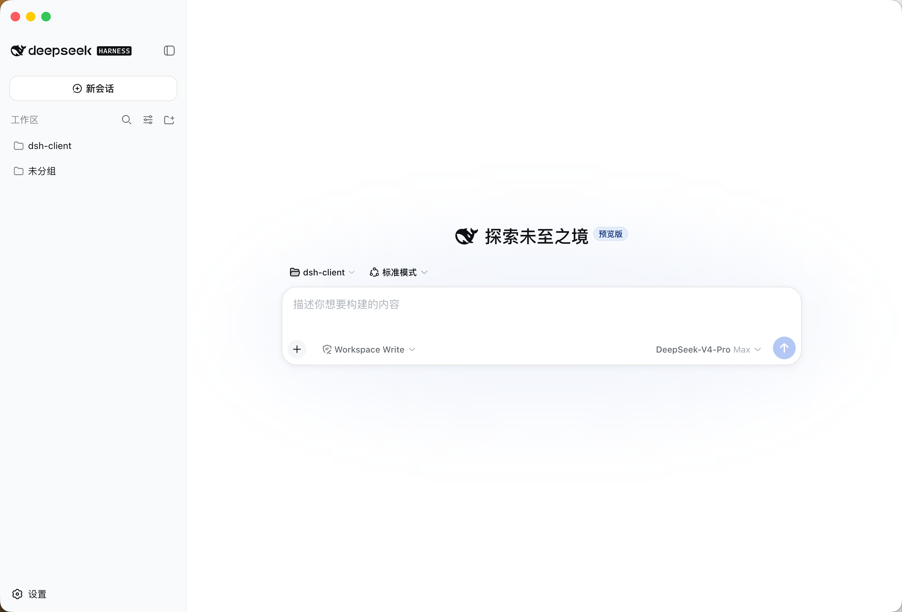

# DSH Client

DSH Client is a native client for the [DeepSeek Harness](https://github.com/deepseek-ai/deepseek-harness) (`dsh`) web GUI. The packaged application is named **DeepSeek Harness**. Its shell supervises a loopback `dsh web` host process, owns application lifetime, and stages the exact pinned harness runtime into the packaged app — no separate Node.js install or terminal window required.

This is an independent community project and is not affiliated with or endorsed by DeepSeek.



## Architecture

```
src/main.ts               Electron shell: window, app menu, security hardening, boot wiring
src/host-supervisor.ts    dsh web child process: spawn, readiness URL parsing, graceful shutdown
src/window-lifecycle.ts   close-to-hide and quit sequencing, independent from Electron
scripts/stage-runtime.mjs materializes the pinned dsh dependency closure into runtime-host/
scripts/verify-packaged-runtime.cjs  afterPack guard: reject packages missing Host artifacts
scripts/release-mac.sh    local signed + notarized build entrypoint (never publishes)
scripts/release-mac.mjs   release preflight, packaging verification; uploads only in CI
scripts/release-assets.mjs  the asset set that makes a Release "complete", shared by both scripts
scripts/smoke-host.mjs    release gate: boots the staged Host and validates its readiness line
scripts/track-dsh.mjs     compares the pin with upstream's newest dsh Release; bumps pin, app version, release notes
.github/workflows/track-dsh.yml  scheduled: new upstream dsh → release
.github/workflows/release.yml    manual: release the version currently on main
.github/workflows/release-macos.yml  the shared build, sign, notarize, verify, publish job
runtime/package.json      exact @deepseek-ai/dsh version pin (no compatibility promise upstream)
runtime-host/package-lock.json  committed lockfile for the rest of the Host closure
```

How the shell and the host fit together:

1. On boot the supervisor spawns `dsh web --host 127.0.0.1 --port 0`. The OS assigns a free loopback port, so there is never a 3080 collision.
2. The harness prints its canonical readiness line (`dsh web: http://127.0.0.1:<port>/?token=<secret>`; the token arrived with the 0.1.5-alpha harness, earlier releases print the bare origin). The supervisor parses it incrementally and validates it strictly (loopback HTTP, root path, explicit port, at most that one `token` query parameter), then hands the loopback URL — origin plus token — to the window.
3. The window's first navigation keeps the token (the API fence binds the session to it and rejects an untokened loopback request); navigation afterward is locked to that origin. Other HTTP(S) links open in the system browser; every permission request is denied; the renderer runs sandboxed with no Node integration.
4. Closing the window hides it while the Host stays alive; clicking the Dock icon restores it. Explicit quit disposes the Host first (SIGTERM, then SIGKILL after the harness' 5s drain) and only then releases Electron's quit sequence.
5. Packaged builds run the staged CLI through Electron's own Node runtime (`ELECTRON_RUN_AS_NODE=1`), so no second Node binary ships.

### macOS traffic-light inset

The shipped harness frontend is unaware of the frameless `hiddenInset` shell, so the shell injects a stylesheet that reserves a 40px strip at the top of the sidebar column for the close/minimize/zoom buttons and marks the full-width top strip as the native window drag region (`[class*="sidebarCol"]` attribute selector, stable across css-module hash changes). Interactive controls are explicitly excluded from the drag region so they keep receiving pointer events. The injection is queued before `loadURL` and re-applied on `dom-ready`; it is never awaited, because `insertCSS` before the renderer commits a document can otherwise stall boot.

Padding the sidebar alone would leave the center and third columns starting under the traffic lights, so the stylesheet also pushes their header rows down onto the sidebar logo's line: `[data-slot="conversation.session.header"] > header` (the center column's session header — the frontend's own title/tabs/actions strip) gets 60px of top padding, and `[data-slot="details"] > * > [class*="_header"]` (the details panel's header row) gets 62px. `data-slot` is the stable seam the frontend declares for these strips, whereas the css-module hash on the same element is not, so both rules select on the attribute and the element type rather than the class; the alignment geometry of each rule is commented in `src/main.ts` next to the injected CSS.

`scripts/verify-inset.mjs` checks the applied geometry over CDP (launch with `--remote-debugging-port=<port>`): the drag region must span the full window width at 40px high and the logo row must start below the traffic-light strip.

## Development

```sh
npm install
npm run stage        # materialize the pinned dsh runtime closure into runtime-host/
npm run dev          # build + launch; quit with the application menu or Cmd+Q
```

`DSH_MAC_NODE_EXECUTABLE` overrides the dev Node binary. The dev host shares your regular `~/.dsh` (credentials, settings, sessions).

## Test & typecheck

```sh
npm test
npm run typecheck
```

## Packaging

```sh
npm run package      # unpacked app for the current platform (dist/)
npm run dist         # unsigned macOS DMG + update ZIP for local validation
npm run dist:signed  # signed + notarized DMG/ZIP + update metadata
```

The staging step installs the Host closure with `npm ci` against the committed `runtime-host/package-lock.json`, keeps npm's hoisted layout (no pnpm symlink store), strips bin symlinks, and fails the build if the CLI entry or the Web frontend dist is missing, or if the harness packages do not all come from the pinned release. An `afterPack` hook re-verifies the whole closure against the pin inside the bundle before signing. The signed-release flow (`scripts/release-mac.mjs`) additionally boots the real staged Host once (`scripts/smoke-host.mjs`) so a harness whose readiness line the shell could not parse fails the release instead of shipping, and wipes `dist/` before packaging so artifacts are asserted and uploaded strictly per release version.

After a signed build, verify the installed artifact:

```sh
codesign --verify --deep --strict --verbose=2 "dist/mac-arm64/DeepSeek Harness.app"
spctl --assess --type execute --verbose=4 "dist/mac-arm64/DeepSeek Harness.app"
xcrun stapler validate "dist/mac-arm64/DeepSeek Harness.app"
```

## Releases and automatic updates

Signed releases use `electron-updater` with the public
[`fatwang2/dsh-client`](https://github.com/fatwang2/dsh-client) GitHub Releases
feed. `electron-builder` embeds that repository into the application and
generates the ZIP, blockmap, and `latest-mac.yml` consumed by Squirrel.Mac.

**Releases are built and published by GitHub Actions only.** One workflow does
that work — `.github/workflows/release-macos.yml` — and two entry points call
it, so the automatic path and the manual path cannot drift:

| Entry point | Trigger | What it ships |
|---|---|---|
| `.github/workflows/track-dsh.yml` | every four hours, or *Run workflow* (optional exact harness version) | the newest upstream `@deepseek-ai/dsh`, from a bump commit it writes itself; also retries a version whose Release is still missing or incomplete |
| `.github/workflows/release.yml` | *Run workflow* on `main` | the version already on `main` — the release button for client-side changes |

Both call `release-macos.yml`, which builds, signs, notarizes, verifies, and
publishes on a GitHub macOS arm64 (Apple silicon) runner. Because they share one
workflow-level concurrency group (`dsh-release`, never cancelled in flight),
only one release touches a version tag at a time, and the release job re-checks
completeness after any bump, so a queued duplicate run skips the expensive build
instead of rebuilding a version that is already out. (GitHub keeps one running
plus one pending run per group; a *third* queued run replaces the pending one,
so a burst of dispatches collapses rather than stacking up.)

That runner is Apple silicon, so Releases and the automatic update feed
currently serve Apple silicon installs. A local `npm run dist:signed` drives the
same electron-builder targets on the host architecture; electron-builder's arch
parameters (`--x64`, `--arm64`) can target a different one.

### Tracking upstream automatically

`.github/workflows/track-dsh.yml` runs every four hours, and on demand from
the Actions tab (*Run workflow*). It compares the pin in `runtime/package.json`
with the newest `dsh-v*` Release in
[`deepseek-ai/deepseek-harness`](https://github.com/deepseek-ai/deepseek-harness/releases)
(highest version, alphas included; upstream marks every cut as a prerelease, so
the npm `latest` dist-tag lags). When upstream has published a newer version
that is also on npm, the release

1. bumps the pin, resolves the Host closure afresh (`stage-runtime.mjs --relock`),
   boots that closure once to prove the shell can still parse its readiness line,
   bumps the app's patch version, and writes `.github/release-notes/<version>.md`
   naming the bundled harness;
2. runs the tests and typecheck, and only then commits to `main` as
   `github-actions[bot]` and pushes — so a harness the client cannot boot with
   fails the run in the working tree instead of landing on `main`;
3. builds, signs, notarizes, verifies, and publishes.

The app version is deliberately independent from the harness version: the
harness ships release candidates, and an installed app on a stable version
would skip a prerelease update. Each tracked upgrade is one patch bump; the
Release title and notes say which harness it bundles.

If a build fails after its bump commit landed, the next run notices that the
current app version has no complete Release yet and retries the release
without bumping again. Complete means the Release is publicly consumable —
published, not a draft, not a pre-release — and carries every asset of the
update feed: the DMG, the update ZIP, its `.zip.blockmap`, and `latest-mac.yml`,
whose `version:` must name that same version. A Release failing any of that
counts as unreleased, so the next run rebuilds and repairs it on the existing
tag (clearing a stray draft/pre-release flag on the way).

A run only proceeds on `main` (both jobs reason about that branch's pin, and
`workflow_dispatch` has no branch filter, so each entry point guards on
`github.ref` itself). While an explicit version pins that version instead of the
newest upstream Release, a version older than the current pin is refused:
explicit versions may not downgrade. Two transient upstream states are handled
without failing the run: a version tagged upstream but not yet on npm holds the
pin and retries on a later tick, and a pin that is ahead of the newest upstream
Release is left alone rather than bumped backwards.

The workflow needs these repository secrets
(Settings → Secrets and variables → Actions):

| Secret | Content |
|---|---|
| `CSC_LINK` | Base64 of the Developer ID Application `.p12` |
| `CSC_KEY_PASSWORD` | Password of that `.p12` |
| `APPLE_API_KEY_P8` | Contents of the App Store Connect API key `.p8` |
| `APPLE_API_KEY_ID` | Key ID of that API key |
| `APPLE_API_ISSUER` | Issuer ID of that API key |

From a Mac that already holds the identity in the login Keychain, export the
Developer ID Application certificate with its private key as a `.p12` from
Keychain Access, then:

```sh
gh secret set CSC_LINK --body "$(base64 -i DeveloperID.p12)"
gh secret set CSC_KEY_PASSWORD
gh secret set APPLE_API_KEY_P8 < ~/.appstoreconnect/private_keys/AuthKey_XXXXXXXXXX.p8
gh secret set APPLE_API_KEY_ID --body XXXXXXXXXX
gh secret set APPLE_API_ISSUER --body 00000000-0000-0000-0000-000000000000
```

### Releasing a client-side change

1. Merge the change on `main` and bump `version` in `package.json` (add
   `.github/release-notes/<version>.md` when the notes matter).
2. Actions → *Release current main* → *Run workflow*.
   - `dry_run` builds, signs, notarizes, and verifies **without publishing and
     without pushing anything to `main`** — a rehearsal leaves the repository
     exactly as it was, so the tracker will not pick the version up afterwards.
   - `harness_version` additionally pins that exact `@deepseek-ai/dsh` first
     (that path patch-bumps the app version itself, so leave `version` alone
     when you use it).
   - `allow_republish` is needed only to replace a version that is already
     fully released; without it the run refuses, which is the intended guard
     against shipping the same version twice. Re-releasing the *same* version
     does not reach installed clients: `electron-updater` compares version
     numbers, so a fix has to go out as a new version.

The run needs a clean checkout of `main`, so push the version bump first. The
preflight then requires branch `main` and `HEAD == origin/main` before it signs,
notarizes, verifies the update metadata, and creates the Release. Bumping the
version is what makes a release possible: if you change client code without
bumping, the tracker still sees the released version on `main` and publishes
nothing — that is the guard working, not a failure. (Conversely, a version that
is on `main` with no Release yet is picked up by the tracker's next tick even if
you never press the button.)

### Building on the maintainer's Mac

Local runs build, sign, notarize, and verify exactly what CI would ship — but
they never publish. Two things enforce that: the local entrypoint
(`scripts/release-mac.sh`) drops the publishing variables before handing off, and
`scripts/release-mac.mjs` uploads only when `DSH_RELEASE_UPLOAD=1` is set on a
real GitHub Actions runner (`GITHUB_ACTIONS=true` plus a run id). `npm run
package` and `npm run dist` pass `--publish never` for the same reason. It is a
guard, not a compiler: hand-exporting every one of those variables on a machine
that is already authenticated to the release repo would still publish, so treat
the local flow as build-and-verify only.

Copy `.env.release.example` to the ignored `.env.release`, configure the
Developer ID identity and App Store Connect API key, then run:

```sh
npm run dist:signed  # sign, notarize, verify; artifacts stay in dist/
```

An unsigned build for your own machine (no credentials needed) is
`npm run dist` — it produces the DMG/ZIP without signing, so it can never be
mistaken for a distributable release.

A signed app checks quietly after startup, downloads in the background, and
offers to restart only after the update is ready. Choosing to restart first
shuts down the bundled Host through the normal graceful path. (A locally built
bundle has no update feed of its own — `npm run package` produces a `--dir`
app without `app-update.yml` — so install a Release DMG to receive updates.)

## Environment

| Variable | Effect |
|---|---|
| `DSH_MAC_OWN_HOME=1` | Confine harness state to the app's data dir (`~/Library/Application Support/dsh-mac/dsh-home`) instead of the shared `~/.dsh`. |
| `DSH_MAC_NODE_EXECUTABLE` | Dev-only: Node-compatible binary used to run the staged CLI. |
| `DSH_MAC=1` | Marker exported to the Host process environment. |
| `DSH_RELEASE_ENV` | Optional path to the local release environment file; defaults to `.env.release`. |
| `DSH_RELEASE_TAG` | Optional Release tag override; defaults to `v<package version>`. |
| `DSH_RELEASE_UPLOAD=1` | Upload to GitHub Releases. Set by the release workflow only; a local machine is refused even with it set. |
| `DSH_REQUIRE_NEW_RELEASE=1` | Refuse to publish a version that already has a complete Release (manual releases; applies to dry runs too). |
| `SKIP_UPLOAD=1` | Explicitly suppress upload for a run that would otherwise publish (belt and braces; local runs never publish). |

All other environment variables pass through to the Host (`DEEPSEEK_API_KEY`, proxies, etc.).

## Updating the harness

The harness is a fast-moving release candidate with explicitly no compatibility
promise, and pinning `@deepseek-ai/dsh` alone does not pin the Host. Its ~186
sibling packages depend on each other through caret ranges, and `^0.1.0-rc.6`
matches `0.1.0-rc.7`, so a lockfile-less install silently produces a CLI from
one release candidate sitting on internals and a Web frontend from another.
`runtime-host/package-lock.json` is therefore committed, staging runs `npm ci`,
and both staging and the `afterPack` hook reject a tree whose harness packages
do not all carry the pinned version.

The tracking workflow performs this upgrade automatically whenever upstream
publishes a new release (see *Tracking upstream automatically*). By hand, it is
the same three steps:

```sh
# 1. bump the exact pin in runtime/package.json
# 2. resolve the closure afresh and rewrite the lockfile
npm run stage -- --relock
# 3. commit runtime/package.json and runtime-host/package-lock.json together
```

Without `--relock`, `npm ci` refuses a pin the lockfile does not satisfy, so a
bump can never reach a package by accident. After upgrading, re-verify startup
and re-run `scripts/verify-inset.mjs`: the harness frontend carries no
compatibility promise for the DOM the traffic-light inset stylesheet targets.

## Roadmap

- DSH_HOME policy switch in the application menu
- Renderer IPC carrier (the transport shape the harness GUI architecture reserves for desktop hosts)

## License

MIT. The packaged app embeds the MIT-licensed `@deepseek-ai/dsh` runtime; see its repository's `THIRD_PARTY_NOTICES.md` for transitive dependency licenses before distribution.
